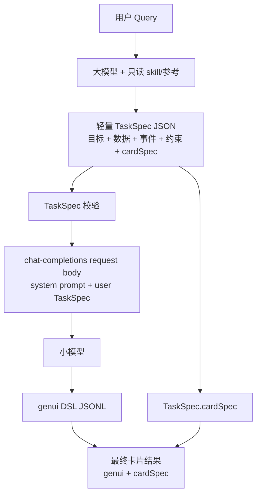

# TaskSpec 协议规范

> 版本：`taskspec/v1`  
> 规则集：`harmony-form-rules/v1`  
> 用途：作为大模型与小模型之间的轻量桥接契约。大模型只给出卡片目标、内容需求、数据/事件/素材能力和 DSL 硬约束；具体布局和组件实现由小模型完成。

## 0. 项目级硬约束

- 禁止修改 `.agents/skills/` 目录下的任何内容。
- `harmony-card-generation` skill 在本项目中视为只读外部依赖。
- 协议、schema、样例、转换脚本、校验脚本可以演进，但不得通过修改 skill 内容来消除不一致。
- 如果 skill 文档与本项目 TaskSpec 流程存在表述冲突，以本文件、`taskspec.schema.json` 和项目脚本为准，并在项目层做适配。

## 1. 设计目标

TaskSpec 要保持短小，不应变成半成品 DSL。

- 只描述“要显示什么、要调用什么、必须遵守什么”。
- 不描述具体布局树、区域划分、宽高预算、组件嵌套和视觉排版。
- `cardSpec` 由大模型生成并直接交付端侧。
- 小模型只生成 `genui` DSL，不生成 `cardspec`。
- chat-completions request body 必须包含 `system` prompt，用来简要说明协议和输出规则。

## 2. 流程



## 3. 顶层结构

```json
{
  "schema": "taskspec/v1",
  "rulesVersion": "harmony-form-rules/v1",
  "userQuery": "...",
  "task": "只输出一个 genui 代码块...",
  "card": {
    "scenario": "status",
    "size": "2x2",
    "requirements": []
  },
  "dataModel": { "value": {} },
  "cardSpec": { "suggestSize": "2x2" },
  "dataCapabilities": [],
  "eventBindings": [],
  "assets": [],
  "rules": { "dsl": [] }
}
```

## 4. 字段说明

### `card`

`card` 只承载卡片意图，不承载布局方案。

```json
{
  "scenario": "device",
  "size": "2x4",
  "requirements": [
    {
      "id": "device_name",
      "type": "identity",
      "label": "Free Clip 2",
      "dataPath": "/device/name",
      "required": true
    }
  ],
  "constraints": ["简洁高级，磨砂玻璃质感"]
}
```

- `scenario`: `status`、`reminder`、`action`、`device`、`summary`。
- `size`: `2x2` 或 `2x4`。只决定 root 目标尺寸，不决定布局。
- `requirements`: 小模型必须表达的内容项。
- `constraints`: 可选，表达非结构化约束，例如视觉风格、信息优先级、必须完整显示的文本。

`requirements[].type` 可选值：

- `identity`: 名称、地点、设备名。
- `primary`: 主答案或主指标。
- `metric`: 指标。
- `status`: 状态。
- `context`: 辅助上下文。
- `media`: 图片或素材。
- `action`: 可点击动作。
- `style`: 视觉风格要求。

### `dataModel`

`dataModel.value` 是小模型生成第 3 行 `updateDataModel.value` 时必须原样使用的初始数据。

### `cardSpec`

`cardSpec` 是大模型生成的最终 CardSpec。

- 静态卡片：只包含 `suggestSize`。
- 动态卡片：包含 `suggestSize` 和 `dataBindings[]`。
- 事件能力不进入 `cardSpec`。

### `dataCapabilities`

列出本次使用的数据能力，并给出小模型可绑定的输出路径。必须与 `cardSpec.dataBindings[]` 对齐。

### `eventBindings`

列出可点击动作。小模型可以把对应 `onClick` 原样挂到组件上。

### `assets`

列出允许使用的素材路径。未声明的图片、网络 URL、SVG 和 base64 SVG 不得使用。

### `rules.dsl`

只包含 DSL 硬约束，不包含具体布局方案。

推荐最小规则集：

```json
[
  "只输出一个 genui 代码块，不输出 cardspec 或解释文字。",
  "genui 恰好 3 行 JSONL，顺序为 createSurface、updateComponents、updateDataModel。",
  "version 固定为 v0.9，catalogId 固定为 ohos.a2ui.extended.catalog。",
  "updateDataModel.path 必须是 /，value 必须等于 TaskSpec.dataModel.value。",
  "root 尺寸按 card.size：2x2=160x160，2x4=320x160。",
  "只能使用 Text、Image、Divider、Progress、Button、Checkbox、Row、Column、List、Stack。",
  "使用 Text.content、Image.src、Button.label，不使用 Text.text/Image.url/Button.action。",
  "onClick 只使用 TaskSpec.eventBindings 中声明的事件。",
  "绑定使用 {\"path\":\"/...\"} 或 formatString，不使用表达式。"
]
```

## 5. 校验规则

发送给小模型前：

- `schema` 必须是 `taskspec/v1`。
- `rulesVersion` 必须是 `harmony-form-rules/v1`。
- `card.size` 必须等于 `cardSpec.suggestSize`。
- `card.requirements[].id` 必须唯一。
- `requirements[].eventRef` 必须能在 `eventBindings[].eventRef` 中找到。
- `requirements[].assetRef` 必须能在 `assets[].assetRef` 中找到。
- `requirements[].dataPath` 必须能从 `dataModel.value` 或 `dataCapabilities[].usedOutputPaths[].path` 推导。
- 静态卡不得包含 `cardSpec.dataBindings`。
- 动态卡的 `cardSpec.dataBindings[]` 必须与 `dataCapabilities[]` 对齐。
- `.agents/skills/` 必须无改动。

小模型输出后：

- 只包含一个 `genui` 代码块。
- 不包含 `cardspec` 代码块。
- `genui` 恰好 3 行 JSONL。
- 第 1 行包含 `createSurface`，第 2 行包含 `updateComponents`，第 3 行包含 `updateDataModel`。
- `updateDataModel.value` 必须等于 `TaskSpec.dataModel.value`。
- `updateComponents.components` 必须是扁平组件数组，所有引用可解析。
- root 尺寸必须与 `TaskSpec.card.size` 一致。

## 6. chat-completions request body

转换脚本生成的请求体必须包含 `system` 和 `user` 两条消息。

- `system`: 简要说明 TaskSpec 协议、小模型职责、输出格式和禁止项。
- `user`: 放入完整 TaskSpec JSON。

示例：

```json
{
  "model": "glm-5.2",
  "messages": [
    {
      "role": "system",
      "content": "你是 HarmonyOS A2UI Form DSL 生成器..."
    },
    {
      "role": "user",
      "content": "{...TaskSpec JSON...}"
    }
  ]
}
```
